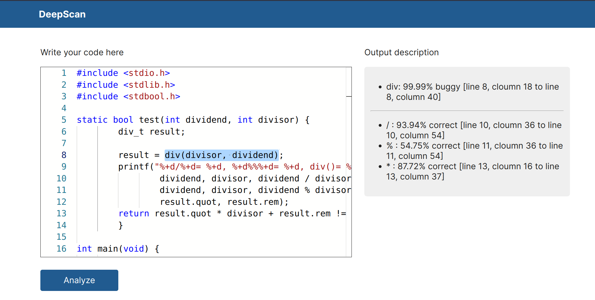

# DeepScan: Automatic Bug Detection in C Language

This machine learning based project involves automatic name-based software bug detection during static program analysis in C language and was developed using Python language.

### Website interface



The aim of this project is to develop a tool that can automatically find bugs in source code through the name analysis technique. Name-based bug detection involves analyzing source code to detect potential bugs based on the names or labels used for variables, functions, and other elements in the code. This project utilizes **Abstract Syntax Tree (AST)** to generate the negative (buggy) samples automatically due to the unavailability of a large set of negative samples.

### Video for Explanation

https://github.com/dipudl/deepscan/assets/61581457/13d750e0-1f58-40e7-9876-aea3263d874e

The project initially collects code snippets from C Code Corpus dataset and parses the code snippets into their corresponding AST using LibClang. It then extracts the positive samples from AST, adjusts and swaps contents of positive samples to generate negative samples. Similarly, it performs data cleaning and tokenization of data using fine-tuned **CodeT5 Tokenizer** and finally the extracted dataset is fed into the **DistilBERT model** for training to identify potential bugs. Currently, DistilBERT model is used for the **detection of bugs related to swapped function arguments and wrong binary operators**. The detection of other types of name-based bugs can be easily done following the similar steps taken in developing current models. The resulting system will be able to automatically detect specific type of bugs in source code, providing a valuable tool for software developers and improving the quality of their code.

### Objectives of this Project

- To create suitable training data consisting of correct and buggy code from a corpus of source code written in the C-programming language.
- To train and evaluate a transformer model capable of name-related bug detection during static code analysis.

---

## Getting Started

These instructions will get you a copy of the project up and running on your local machine for development and testing purposes.

### Prerequisites

What things you need to install for running this application

```
Python
Python package manager (pip)
Node.js package manager (npm)
```

### Installing & getting started

Clone this project and open with Visual Studio Code(preferred) or any text editor

```
git clone https://github.com/dipudl/deepscan.git
```

Install the required Python dependencies

```
pip install clang transformers fastapi "uvicorn[standard]" pydantic
```

You need to download the required machine learning models (named "pytorch_model.bin"). So, download first model from [here](https://huggingface.co/dipudl/function-args-swap-bug-distilbert-model/blob/main/pytorch_model.bin) and put it inside the folder "backend/function-args-swap-bug/model/". Download the second model from [here](https://huggingface.co/dipudl/wrong-binary-operator-bug-distilbert-model/blob/main/pytorch_model.bin) and put it inside the folder "backend/wrong-binary-operator-bug/model/".

Go to 'backend' folder and start the Python server using uvicorn (default port is 8000). Sometimes configuration of clang library can be tricky so I suggest you to see its documentation properly and install other softwares if necessary.

```
uvicorn main:app --reload
```

Go to 'frontend' folder and install all required Node.js dependencies
(using npm package manager for example)

```
npm i
```

Start React.js frontend application

```
npm start
```

The machine learning models used in this program need powerful computational resources so GPU is preferred. Anyways, you can test if it runs properly in your computer.

## Built With

* [Python](https://www.python.org/) - For data extraction and machine learning program
* [React.js](https://react.dev/) - Frontend web development library
* [FastAPI](https://fastapi.tiangolo.com/) - Serverside framework for building API

## Contributing

All the helpful pull requests will be accepted.

## License

This project is licensed under the MIT License - see the [LICENSE](LICENSE) file for details